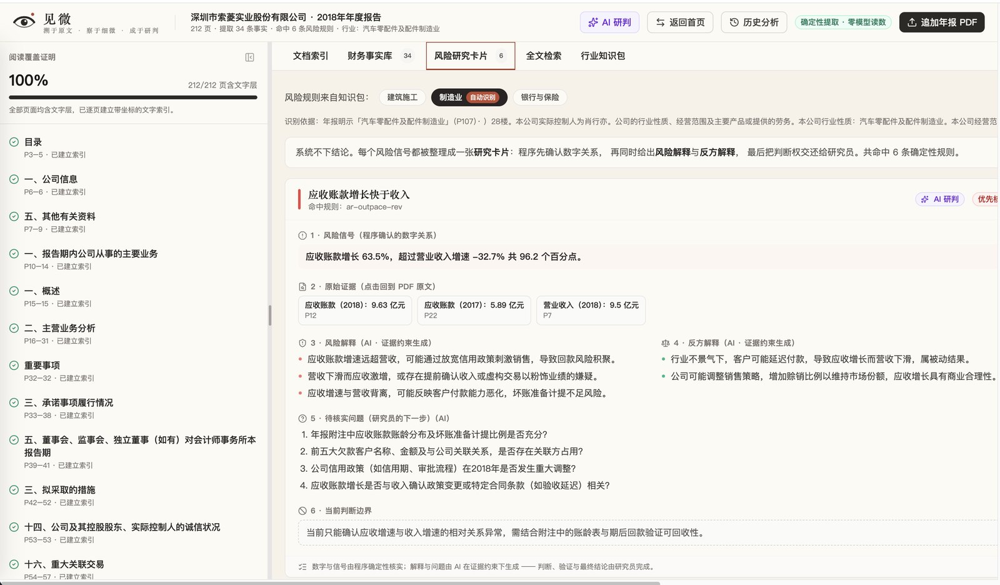

# 见微

> 为财务研究员 / 风控与尽调人员解决「AI 读财报不可信、不可验」的问题——可溯源的财报理解与推理助手：AI 负责阅读、整理、比较和提问，研究员负责判断与结论。

🏆 **AIY 黑客松 2026 深圳站** 参赛作品
🏷 命题企业 / 赛道：金稳院赛道
👤 团队：深金妙算
🔢 团队编号：AD0075
🌐 在线体验（手机/电脑均可）：**https://skylar-cuizhi.github.io/aiy202608-ad0075-shenjinmiaosuan/**（溯源工作台直达：`?trace=1`）

---

## 👥 团队分工

| 成员 | 负责 |
|---|---|
| 陈晙鹏 | 技术开发（确定性提取、风险规则引擎、跨报告分歧检测与证据定位） |
| 李冠莹 | 演示视频 |
| 崔智 | 技术开发 |
| 毕紫晨 | 场外支持（参与项目早期构思） |

## ✨ 它能做什么

- **阅读覆盖证明 + 全文索引**：逐页建立带坐标的文字索引，明示覆盖率（如 231/231 页）与章节状态，扫描页诚实标记「没读」；每个数字、每张风险卡都可点击跳回 PDF 原文位置
- **确定性提取 + 行业知识包风险规则**：程序按表格坐标提取收入/利润/现金流/应收等事实（零模型读数），加载行业知识包做同比与交叉验证，输出「信号 + 原始证据 + 风险解释 + 反方解释 + 待核实问题 + 判断边界」六段式研究卡片
- **多年报跨期分析**：多份年报批量导入自动归位；时间轴主视图 + 背离图（累计利润 vs 累计现金流）+ 异常热力矩阵；自动检测跨报告重述分歧、洗大澡、毛利率异常稳定，三链印证时输出「推测：盈余管理风险极高」组合卡
- **证据约束下的卷宗 AI 对话**：围绕当前卷宗追问，回答均带原文页码并声明证据边界，超证据断言如实回答「需要查证」
- **调研报告溯源（网络来源原文标红）**：导入带 `[(来源)](URL)` 引证的调研报告（脚注式 `[^N^]` 引证自动归一化，PDF 来源同样抓取解析），左侧阅读报告，点击引证右侧弹出该网络来源的原文并标红支撑主张的原句；来源按 A–D 可信度分级，抓取失败与无法对句的引证诚实标记，不作掩饰

## 🧪 真实判例验证

以 2020 年被证监会处罚的索菱股份（002766）为回测标的：仅依据处罚前公开的 2016–2019 四份年报（800+ 页），产品自动提取 80 条带原文坐标的事实，捕获 20 处跨报告重述分歧（含 2017/2018 归母净利润重述），触发「推测：盈余管理风险极高」组合研判——与处罚文书方向一致。

## 🎬 演示



## 🛠 用到的技术 / AI 工具

- 前端：React + TypeScript + Vite + Tailwind CSS + Radix UI
- 财报解析：pdf.js + 自研表格坐标解析（刻意去 AI 化，数字提取与计算全部由程序确定性完成）
- AI 解释层：DeepSeek（仅在证据约束下生成风险解释 / 反方解释 / 待核实问题与多年综合研判；失败自动回退模板文案并如实标注）
- 本地持久化：IndexedDB（分析记录保存在本机，API Key 不出本机）

## 🚀 怎么跑起来

```bash
npm install
npm run dev
```

AI 解释层需配置 DeepSeek Key：复制 `.env.example` 为 `.env` 并填入 `DEEPSEEK_API_KEY`（不配置也可体验演示模式，内置虚构公司样例）。

「调研溯源」模块：欢迎页点击「研于网海 · 溯源调研报告」进入（内置智能眼镜调研演示包）。

### 🔁 与 GPT / Kimi 深度研究配合的标准流程

```
GPT / Kimi 深度研究（产出 markdown 报告 + 引证 URL，GPT 只当研究员，不做原文转录）
        ↓ 整段粘贴
见微「粘贴报告」（本地管线自动抓取可直连的来源）
        ↓ 少数反爬来源（403 / 断连，如 McKinsey、BCG）
WebBridge 浏览器补抓：驱动本机真实浏览器下载原文（带正常浏览器指纹与登录态，不怕反爬）
        ↓ 合并回溯源包、重新定位标红
完整溯源报告（桌面 / 手机在线版均可展示）
```

> 原则：GPT 负责出报告、给出处；**原文永远走真实渠道获取**。不让 AI 转录原文——转录可能凭记忆编造，那是溯源系统自己要防的假证据。补录来源在前端会标注抓取方式（如「WebBridge 浏览器补抓（PDF 原文）」）。

**方式一 · 粘贴即用（推荐）**：先启动本地管线服务，再在溯源工作台点「粘贴报告」，整段粘贴 Markdown →「生成原文标红」。服务仅监听本机回环，数据不出本机。

```bash
python3 tools/trace/server.py   # 启动后保持运行（127.0.0.1:8787）
```

**方式二 · 命令行生成溯源包**（适合批量处理）：

```bash
python3 tools/trace/build_data.py 你的报告.md trace-out   # 抓原文、定位锚点、可信度分级
python3 tools/trace/emit_pack.py 你的报告.md trace-out/sources.json 你的报告.trace.json
# 然后在溯源工作台点「导入溯源包」选择生成的 JSON
```

**方式三 · 反爬来源补抓（McKinsey / BCG / 需登录站点）**：管线跑完后若有「未能获取」的来源，用 Kimi WebBridge 驱动本机真实浏览器补抓，再合并回溯源包：

```bash
python3 tools/trace/fetch_webbridge.py html "S5=https://…"   # 网页正文（S 编号见溯源包）
python3 tools/trace/fetch_webbridge.py pdf  "S8=https://….pdf"  # PDF 经浏览器原生下载回收
python3 tools/trace/apply_patch.py 你的报告.trace.json          # 合并补抓原文并重新定位标红
```

> 抓取的原文缓存在工作区 `trace-patch/`（`<编号>.txt|.pdf`），可追溯复用。遇到滑块验证码等真人挑战时，在浏览器标签组里手动完成后重跑对应编号即可。

## 📌 后续计划

- 引入监管文书（处罚决定书）交叉验证，把「推测」升级为「印证」
- 同行业可比公司基准线（毛利率波动、应收占比的行业分位）
- 扩展行业知识包（建筑施工、银行保险、房地产、医药等）
- 邀请真实研究员试用，量化时间节省与漏检率改善

---

## 📄 版权与许可

本作品版权归 **陈晙鹏、李冠莹、崔智、毕紫晨** 共同所有，采用 [MIT License](./LICENSE) 开源，使用请署名。

> 本项目为 AIY 黑客松参赛作品，作品归团队所有；AIY 组委会仅作收录与展示。
